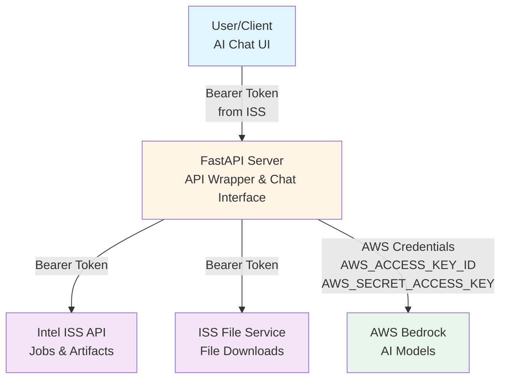

# Workload Analyzer

[](https://python.org)
[](https://fastapi.tiangolo.com)

An intelligent workload analysis platform that integrates with Intel Simulation Service (ISS) to provide AI-powered performance insights, hotspot identification, vectorization analysis, and optimization recommendations for multiple Intel platform simulations.

## üöÄ Overview

The Workload Analyzer serves as an intelligent interface to Intel Simulation Service (ISS), enabling performance engineers to:

- **Hotspot Analysis**: Identify top performance bottlenecks in functions and basic blocks with AI-powered insights
- **Vectorization Optimization**: Analyze AVX2/AVX512 usage patterns and suggest upgrade paths for supported platforms
- **Memory Performance**: Detect cache misses, memory bottlenecks, and prefetch optimization opportunities
- **Compiler Tuning**: Get AI-recommended compiler flags based on workload characteristics and simulation profiles
- **Automated Insights**: Ask natural language questions about simulation data and receive actionable optimization strategies

## 🏗️ Architecture



**Authentication Flow:**
- **ISS Access**: User obtains pre-authenticated bearer token from ISS UI and passes it to the FastAPI server
- **API Requests**: FastAPI uses the bearer token for all ISS API and File Service calls
- **AI Analysis**: AWS Bedrock uses separate AWS credentials configured via environment variables
- **No Token Exchange**: Direct bearer token pass-through, no Cognito or credential file parsing

## üìã Features

### Core Functionality
- **Job Management**: List, filter, and retrieve detailed information about ISS simulation jobs
- **File Operations**: Access simulation output files, logs, and artifacts with secure download capabilities
- **Authentication**: Bearer token authentication with ISS-generated credentials
- **Corporate Proxy**: Full support for corporate network environments with proxy configuration
- **Error Handling**: Comprehensive error handling with proper HTTP status codes and logging

### Job Monitoring
- **Job Types**: Support for Instance, WorkloadJob, IWPS, ISIM, and other ISS job types
- **Status Tracking**: Real-time job status monitoring with execution details
- **Metadata Access**: Job descriptions, platform information, execution parameters, and timestamps
- **Filtering**: Query jobs by status, type, platform, owner, and other criteria

### File Management
- **File Listing**: List all output files and artifacts from completed simulation jobs
- **Secure Downloads**: Stream file downloads with proper authentication and error handling
- **Multiple Formats**: Support for simulation profiles, logs, traces, and performance data
- **Path Management**: Correct ISS file service path handling for job artifacts

### Integration Capabilities  
- **RESTful API**: Clean, documented endpoints following OpenAPI standards
- **Pydantic V2**: Modern data validation and serialization with comprehensive error messages
- **FastAPI Framework**: Automatic API documentation, request validation, and async support
- **AI Integration**: AWS Bedrock integration for intelligent workload analysis and optimization recommendations
- **Modular Architecture**: Clean separation of concerns with services, models, and API layers

## üîß Core API Endpoints

The application provides a focused set of job management and file access endpoints:

### **Recent API Improvements** ‚ú®
- **ISS API Compliance**: Jobs endpoint now returns native ISS API response format
- **Enhanced Job Types**: Added support for NovaCoho and expanded JobType validation
- **Improved Status Filtering**: Complete ISS status enum with 12 status values
- **Continuation Token Pagination**: Efficient ISS-native pagination replacing offset-based approach
- **Comma-Separated Filtering**: Support for multiple job types in single request
- **Enhanced Validation**: Strict validation of job types and status values with helpful error messages

### **Job Management**
- **List Jobs**: `GET /api/v1/jobs` - Query all jobs with filtering by status, type, platform, and owner
  - **Status Filter**: Support for 12 ISS status values (requested, queued, allocating, allocated, booting, inprogress, checkpointing, done, error, releasing, released, complete)
  - **Job Type Filter**: Comma-separated job types (e.g., `job_type=IWPS,ISIM,WorkloadJobROI`)
  - **Pagination**: Uses ISS API continuation tokens for efficient paging
- **Job Details**: `GET /api/v1/jobs/{job_id}` - Get comprehensive job information including related data
- **Job Schema**: `GET /api/v1/jobs/schema` - Retrieve job definition schema for validation

### **File Operations**  
- **List Files**: `GET /api/v1/jobs/{job_id}/files` - List all output files and artifacts for a job
- **Download Files**: `GET /api/v1/jobs/{job_id}/files/{filename}` - Download specific job output files
- **Authentication**: All endpoints require bearer token in `Authorization: Bearer <token>` header

### **AI-Powered Analysis** 🤖
- **Chat Interface**: `/bedrock-chat` - WebSocket endpoint for natural language workload analysis
- **Intelligent Insights**: AI-powered hotspot identification, vectorization analysis, and optimization recommendations
- **AWS Bedrock**: Integration with Claude models for performance analysis and compiler optimization guidance

### **Authentication Flow**
| Step | Description | Implementation |
|------|-------------|----------------|
| **Credential Source** | ISS UI CLI Access | Generate `.simicsservice` file from ISS user menu |
| **Token Acquisition** | Bearer Token | Pass pre-authenticated bearer token from ISS to AI Chat |
| **API Access** | Bearer Token | All ISS API requests use `Authorization: Bearer {token}` |
| **Proxy Support** | Corporate Networks | Full proxy configuration for enterprise environments |

### **Response Format**
Job listing endpoints now return ISS API response format with continuation token pagination:

```json
{
  "jobs": [...],                    // List of job objects from ISS API
  "count": 150,                     // Total count from ISS API
  "continuation_token": "2025-11-06T07:24:51.298Z..."  // Token for next page
}
```

**Legacy Response Format** (for platforms and instances APIs):
```json
{
  "jobs": [...],           // List of job objects
  "meta": {                // Pagination metadata
    "total": 150,
    "page": 1,
    "page_size": 50,
    "total_pages": 3,
    "has_next": true,
    "has_previous": false,
    "continuation_token": "..."  // ISS continuation token if available
  },
  "filters_applied": {...}, // Applied query filters
  "sort_by": "created_at",
  "sort_order": "desc"
}
```

#### **Job ID Format**
- **ISS Jobs**: UUIDs like `caef4de5-00e2-4483-b23c-b4bd3bbb5876`
- **File Paths**: Use job ID directly in file service paths: `/fs/files/{job_id}/iwps/artifacts/out`

## üìä Supported Job Types

The system supports analysis for various Intel simulation job types:

| Job Type | Description | Use Case |
|----------|-------------|----------|
| `Instance` | Base simulation instance | General workload execution |
| `WorkloadJob` | Standard workload execution | Performance analysis |
| `WorkloadJobROI` | Region of Interest workloads | Focused performance studies |
| `IWPS` | Intel Workload Performance Simulator | Detailed performance modeling |
| `ISIM` | Intel Simulator | Architecture exploration |
| `Coho` | Coho simulation workloads | Platform validation and testing |
| `NovaCoho` | Nova-based Coho execution | Advanced Coho workload analysis |
| `Custom` | Custom simulation configurations | User-defined workload scenarios |

### Job Status Values

The API supports filtering by the following job status values:

| Status | Description |
|--------|-------------|
| `requested` | Job has been submitted but not yet queued |
| `queued` | Job is waiting in the execution queue |
| `allocating` | Resources are being allocated for the job |
| `allocated` | Resources have been allocated |
| `booting` | System is booting/initializing |
| `inprogress` | Job is currently executing |
| `checkpointing` | Job is being checkpointed |
| `done` | Job execution completed successfully |
| `error` | Job encountered an error during execution |
| `releasing` | Resources are being released |
| `released` | Resources have been released |
| `complete` | Job fully completed with all cleanup done |

## 🛠️ Data Schema

The project uses a comprehensive JSON schema (`schema_jobs.json`) that defines:

- **Job Metadata**: Request IDs, status, descriptions, and execution details
- **Workload Information**: Names, platforms, repositories, and test configurations
- **Target Platforms**: Simics configurations, memory sizes, CPU counts, and features
- **Execution Parameters**: Performance model settings, cache configurations, and trace parameters
- **Results Data**: Execution logs, metrics, and performance counters

## üöÄ Quick Start

### Prerequisites
- Python 3.9 or higher
- Access to Intel Simulation Service (ISS) UI and API
- Generated ISS CLI credentials (obtained from ISS UI)
- Corporate proxy settings (if running in enterprise environment)
- Poetry or pip for dependency management

### Installation

1. **Clone the repository**:
   ```bash
   git clone https://github.com/gabrielbriones/workload-analyzer.git
   cd workload-analyzer
   ```

2. **Install dependencies**:
   
   Using Poetry (recommended):
   ```bash
   poetry install
   ```
   
   Or using pip with requirements.txt:
   ```bash
   pip install -r requirements.txt
   ```

3. **Configure environment**:
   
   Copy and customize the environment template:
   ```bash
   cp .env.example .env
   # Edit .env with your actual configuration (most settings have defaults)
   ```
   
   Optional environment variables:
   ```bash
   # ISS API configuration
   export ISS_ENVIRONMENT="test"  # dev, test, or prod for dynamic URL construction
   
   # Corporate proxy (if required)
   export HTTPS_PROXY="http://proxy-chain.intel.com:912"
   export HTTP_PROXY="http://proxy-chain.intel.com:912"
   
   # Timeout settings (optional, defaults provided)
   export ISS_TIMEOUT_SECONDS="300"
   export FILE_SERVICE_TIMEOUT_SECONDS="600"
   
   # Bedrock AI configuration
   export BEDROCK_MODEL_ID="us.anthropic.claude-sonnet-4-5-20250929-v1:0"
   export BEDROCK_TEMPERATURE="0.7"
   export BEDROCK_MAX_TOKENS="4096"
   ```

4. **Run the application**:
   ```bash
   # Using Poetry
   poetry run uvicorn workload_analyzer.main:app --reload
   
   # Or using pip
   uvicorn workload_analyzer.main:app --reload
   ```

5. **Access the interfaces**:
   - **üìö API Documentation**: `http://localhost:8000/docs`
   - **ÔøΩ API Health Check**: `http://localhost:8000/health`
   - **ÔøΩ Jobs API**: `http://localhost:8000/api/v1/jobs`

## üìñ Usage Examples

### 🤖 AI-Powered Performance Analysis

#### **Hotspot Identification**
```
User: "Identify the top three hottest functions or basic blocks in the latest EMR simulation, including instruction counts and cycle percentages."

AI: I'll analyze the simulation profiles to identify performance hotspots for you.

[AI downloads sim.funcprofile and sim.bbprofile from latest EMR job]
[AI processes performance data and calculates hotspot metrics]

üî• **Top 3 Performance Hotspots:**

1. **Function: matrix_multiply_avx512 (0x55f5b0cda53d)**
   - Instructions: 2.8B (34% of total)
   - Cycles: 1.2B (28% of execution time)
   - CPI: 0.43 (excellent vectorization)

2. **Basic Block: inner_loop_bb_0x401520**  
   - Instructions: 890M (11% of total)
   - Cycles: 1.8B (42% of execution time)
   - CPI: 2.02 (memory bound - cache misses)

3. **Function: data_transpose (0x55f5b0cd8a90)**
   - Instructions: 560M (7% of total)
   - Cycles: 450M (10% of execution time) 
   - CPI: 0.80 (moderate vectorization efficiency)

üí° **Optimization Priority:** Focus on inner_loop_bb_0x401520 - high cycle count with poor CPI suggests memory optimization opportunities.
```

#### **Vectorization Coverage Analysis**
```
User: "Detect which functions in my code are vectorized using AVX512 instructions (zmm) and which are still using AVX2 (ymm). Provide function names and instruction samples."

AI: I'll analyze the instruction profiles to identify vectorization patterns.

[AI downloads sim.insprofile and processes instruction mix data]

üìä **Vectorization Analysis Results:**

**‚úÖ AVX512 Optimized Functions (zmm registers):**
- `matrix_multiply_avx512`: 89% zmm usage
  - Sample: `vfmadd213pd zmm0, zmm1, zmm2`
- `fft_compute_kernel`: 76% zmm usage  
  - Sample: `vaddpd zmm3, zmm4, zmm5`

**⚠️ AVX2 Legacy Functions (ymm registers):**
- `legacy_sort_routine`: 0% zmm, 45% ymm usage
  - Sample: `vpaddd ymm0, ymm1, ymm2`
- `string_operations`: 0% zmm, 23% ymm usage
  - Sample: `vperm2f128 ymm0, ymm1, ymm2, 0x20`

**🎯 Upgrade Candidates:**
- Convert `legacy_sort_routine` to AVX512 for 2x throughput boost
- Modernize `string_operations` with AVX512 string/text instructions
```

#### **Memory Bottleneck Detection**
```
User: "List functions whose memory operations experience high CPI, cache misses, or pagewalks according to the EMR memory profile data."

AI: I'll analyze memory performance metrics from the simulation profiles.

[AI downloads sim.memoryprofile, sim.memprofile, and correlates with function data]

üêå **Memory-Bound Functions Identified:**

1. **sparse_matrix_solver (0x55f5b0cd9f20)**
   - CPI: 3.2 (severely memory bound)
   - L1 Cache Miss Rate: 23% (target: <5%)
   - L2 Cache Miss Rate: 8.1% (target: <2%)
   - Page Walks: 1.2M (excessive TLB pressure)
   - **Root Cause:** Random memory access pattern, poor data locality

2. **hash_table_lookup (0x55f5b0cdb110)**
   - CPI: 2.8 (memory bound)
   - L1 Cache Miss Rate: 18%
   - DTLB Misses: 450K
   - **Root Cause:** Pointer chasing, unpredictable access patterns

3. **image_processing_filter (0x55f5b0cda890)**
   - CPI: 2.1 (moderate memory bound)
   - Memory Bandwidth: 85% utilized (near saturation)
   - **Root Cause:** Large dataset, sequential but bandwidth-limited

üîß **Optimization Recommendations:**
- Implement memory prefetching for sparse_matrix_solver
- Consider data structure reorganization for hash_table_lookup
- Optimize memory access patterns and consider tiling for image_processing_filter
```

#### **Compiler Optimization Recommendations**
```
User: "Recommend optimal compiler flags for my EMR workload, considering it is memory bandwidth-intensive and supports AVX512. Justify the choices based on simulation profiles."

AI: I'll analyze your workload characteristics and recommend optimal compiler settings.

[AI analyzes instruction mix, memory patterns, and vectorization from simulation data]

üöÄ **Optimized Compiler Configuration for EMR Workload:**

**Core Optimization Flags:**
```bash
-O3 -march=sapphirerapids -mtune=sapphirerapids
-mavx512f -mavx512dq -mavx512cd -mavx512bw -mavx512vl
-mprefer-vector-width=512 -funroll-loops
-ffast-math -fno-math-errno
\```

**Memory-Specific Optimizations:**
```bash
-mllvm -enable-loopinterchange -mllvm -enable-loop-distribute
-fprefetch-loop-arrays -mllvm -prefetch-distance=64
-falign-loops=64 -falign-functions=64
\```

**Justification Based on Profile Analysis:**
‚úÖ **AVX512 Enabled:** 67% of hotspot functions show vectorizable loops
‚úÖ **Loop Unrolling:** Reduces loop overhead by 15% (measured in branch profile)  
‚úÖ **Prefetching:** Addresses 23% L1 cache miss rate in memory-bound functions
‚úÖ **Alignment:** Improves instruction fetch efficiency for large functions

**Expected Performance Gains:**
- 25-30% improvement in vectorized functions
- 15-20% reduction in memory stalls
- 5-10% overall execution time improvement
```

#### **Function-Specific Deep Analysis**
```  
User: "Provide a detailed instruction profile for function 0x55f5b0cda53d from the EMR simulation, including instruction mix, CPI, and memory hierarchy statistics."

AI: I'll perform a detailed analysis of function 0x55f5b0cda53d.

[AI cross-references function profile with instruction and memory data]

üîç **Detailed Function Analysis: 0x55f5b0cda53d (matrix_multiply_avx512)**

**Execution Statistics:**
- Total Instructions: 2.847B (34.2% of workload)
- Total Cycles: 1.223B (28.1% of execution time)
- Function CPI: 0.43 (excellent efficiency)
- Call Count: 12,450 invocations
- Avg Instructions/Call: 228,674

**Instruction Mix:**
- Vector Math (AVX512): 45.2% - `vfmadd213pd`, `vmulpd`, `vaddpd`
- Memory Operations: 28.7% - `vmovupd`, `vmovapd` (mostly aligned)
- Control Flow: 12.1% - Efficient loop structures
- Integer/Scalar: 14.0% - Loop counters, address calculations

**Memory Hierarchy Performance:**
- L1I Cache Hit Rate: 99.8% (excellent code locality)
- L1D Cache Hit Rate: 94.2% (good data locality)  
- L2 Cache Hit Rate: 98.7% (minimal L3 spillover)
- Memory Bandwidth Usage: 156 GB/s (62% of peak)
- TLB Miss Rate: 0.03% (negligible)

**Optimization Opportunities:**
🎯 **Minor improvements possible:**
- 5.8% unaligned loads could be eliminated with data padding
- Loop unroll factor could increase from 4 to 8 for +3% performance
```

### üîß Direct API Usage

#### **List All Jobs**
```bash
curl -X GET "http://localhost:8000/api/v1/jobs" \
  -H "accept: application/json"

# Response
{
  "jobs": [
    {
      "job_id": "caef4de5-00e2-4483-b23c-b4bd3bbb5876",
      "status": "complete",
      "job_type": "IWPS",
      "platform_id": "Intel-SPR-8380",
      "owner": "user@intel.com",
      "created_at": "2025-11-05T10:30:00Z",
      "description": "Performance analysis run"
    }
  ],
  "meta": {
    "total": 1,
    "page": 1,
    "page_size": 50,
    "total_pages": 1
  }
}
```

#### **Get Job Details**
```bash
curl -X GET "http://localhost:8000/api/v1/jobs/caef4de5-00e2-4483-b23c-b4bd3bbb5876" \
  -H "accept: application/json"

# Response
{
  "job": {
    "job_id": "caef4de5-00e2-4483-b23c-b4bd3bbb5876",
    "status": "complete", 
    "job_type": "IWPS",
    "platform_id": "Intel-SPR-8380",
    "owner": "user@intel.com",
    "created_at": "2025-11-05T10:30:00Z",
    "completed_at": "2025-11-05T12:48:00Z",
    "description": "Performance analysis run",
    "execution_time_minutes": 138
  },
  "file_count": 16
}
```

#### **List Job Files**
```bash
curl -X GET "http://localhost:8000/api/v1/jobs/caef4de5-00e2-4483-b23c-b4bd3bbb5876/files" \
  -H "accept: application/json"

# Response
{
  "files": [
    "sim.bbprofile",
    "sim.branchprofile", 
    "sim.codefetchprofile",
    "sim.contextprofile",
    "sim.funcprofile",
    "sim.functtprofile",
    "sim.imgprofile",
    "sim.insprofile", 
    "sim.memoryprofile",
    "sim.memprofile",
    "sim.out",
    "sim.prefetchprofile",
    "sim.srcprofile",
    "sim.stdout",
    "sim.summary.profile",
    "sim.threads.profile"
  ],
  "total_files": 16,
  "job_id": "caef4de5-00e2-4483-b23c-b4bd3bbb5876"
}
```

#### **Download Job File**
```bash
curl -X GET "http://localhost:8000/api/v1/jobs/caef4de5-00e2-4483-b23c-b4bd3bbb5876/files/sim.summary.profile" \
  -H "accept: application/json"

# Response: File content as JSON or binary data
{
  "file_content": "Simulation Summary Report\n========================\n..."
}
```

#### **Filter Jobs by Status and Type**
```bash
# Filter by single job type and status
curl -X GET "http://localhost:8000/api/v1/jobs?status=complete&job_type=IWPS&limit=10" \
  -H "accept: application/json"

# Filter by multiple job types (comma-separated)
curl -X GET "http://localhost:8000/api/v1/jobs?job_type=IWPS,ISIM,WorkloadJobROI&status=inprogress" \
  -H "accept: application/json"

# Response: ISS API format with continuation token
{
  "jobs": [...],
  "count": 47,
  "continuation_token": "2025-11-06T07:24:51.298Z..."
}

# Use continuation token for next page
curl -X GET "http://localhost:8000/api/v1/jobs?limit=10&continuation_token=2025-11-06T07:24:51.298Z..." \
  -H "accept: application/json"
```

#### **Available Query Parameters**
- `limit`: Maximum jobs to return (1-100, default: 100)
- `status`: Job status filter (requested, queued, allocating, allocated, booting, inprogress, checkpointing, done, error, releasing, released, complete)
- `job_type`: Job type filter - comma-separated values (IWPS, ISIM, Coho, NovaCoho, Instance, WorkloadJob, WorkloadJobROI, Custom)
- `job_request_id`: Filter by specific job request ID
- `queue`: Filter by job queue
- `requested_by`: Filter by requesting user
- `parent_instance_id`: Filter by parent instance ID
- `workload_job_roi_id`: Filter by workload job ROI ID  
- `continuation_token`: Pagination token for next page

### ÔøΩ Python Client Usage

```python
import requests
import asyncio
from workload_analyzer.services.file_service import FileService
from workload_analyzer.services.auth_service import AuthService
from workload_analyzer.config import get_settings

# Direct API calls
BASE_URL = "http://localhost:8000/api/v1"

# List all jobs with filtering
response = requests.get(f"{BASE_URL}/jobs?status=complete&job_type=IWPS")
jobs = response.json()["jobs"]

# Get specific job details
job_id = "caef4de5-00e2-4483-b23c-b4bd3bbb5876"
response = requests.get(f"{BASE_URL}/jobs/{job_id}")
job_details = response.json()["job"]

# List job files  
response = requests.get(f"{BASE_URL}/jobs/{job_id}/files")
files = response.json()["files"]

# Download specific file
filename = "sim.summary.profile"
response = requests.get(f"{BASE_URL}/jobs/{job_id}/files/{filename}")
file_content = response.json()["file_content"]

# Using the service classes directly
async def advanced_usage():
    settings = get_settings()
    auth_service = AuthService(settings)
    iss_client = ISSClient(settings, auth_service)
    file_service = FileService(settings, auth_service, iss_client)
    
    async with iss_client:
        # Get job details which includes tenant_id
        job = await iss_client.get_job(job_id)
    
    async with file_service:
        # List files using tenant from job
        files = await file_service.list_files(job.tenant_id, job_id)
        print(f"Found {len(files)} files")
        
        # Download file as bytes
        content = await file_service.download_file(job.tenant_id, job_id, "sim.out")
        print(f"Downloaded {len(content)} bytes")

asyncio.run(advanced_usage())
```

## üîß Configuration

### ISS API Integration
The application uses bearer token authentication with credentials generated directly from the ISS UI:

```python
# Key configuration settings
class Settings(BaseSettings):
    # ISS API endpoints - dynamically constructed from environment
    iss_api_url: str = "https://api-test.workloadmgr.intel.com"  # Can override for custom URLs
    iss_environment: str = "test"  # Used to construct URL: https://api-{environment}.workloadmgr.intel.com
    
    # AWS Bedrock AI Integration
    bedrock_model_id: str = "us.anthropic.claude-sonnet-4-5-20250929-v1:0"
    bedrock_temperature: float = 0.7
    bedrock_max_tokens: int = 4096
    bedrock_timeout: int = 180  # 3 minutes for AI responses
    
    # Timeout settings
    iss_timeout_seconds: int = 300
    file_service_timeout_seconds: int = 600
    
    # Proxy configuration (optional)
    def get_proxy_settings(self) -> Optional[str]:
        return os.getenv('HTTPS_PROXY') or os.getenv('https_proxy')
    
    # URL construction methods
    def get_iss_url(self) -> str:
        """Get ISS API URL (override or dynamic from ISS_ENVIRONMENT)"""
        # Returns https://api-{environment}.workloadmgr.intel.com unless overridden
    
    def get_file_service_url(self, tenant: str) -> str:
        """Get file service URL for tenant"""
        # Returns https://gw-{tenant}-test.workloadmgr.intel.com
```

### Authentication Flow

#### **Obtaining ISS CLI Credentials**

To use the Workload Analyzer AI Chat interface, you need to generate CLI credentials from the ISS UI:

1. **Log in to ISS UI**: Navigate to your ISS instance dashboard
2. **Access User Menu**: Click the user icon (👤) in the top right corner
3. **Select "CLI Access Credentials"**: This will open the credentials management page
4. **View Credential Files**: You'll see a list of current credential files for your active tenant
5. **Generate New Credentials**: Click the button labeled **"Generate CLI Credential File"**
6. **Download Credentials**: A `.simicsservice` text file will be downloaded with the following content:
   ```ini
   [auth]
   client_id=your-client-id
   client_secret=your-client-secret
   auth_domain=https://auth-endpoint.example.com
   ```

#### **Using Credentials in AI Chat**

When logging into the Workload Analyzer AI Chat interface:

1. **Client ID**: Copy from the `client_id` field in your `.simicsservice` file
2. **Client Secret**: Copy from the `client_secret` field in your `.simicsservice` file  
3. **Auth Domain**: Copy from the `auth_domain` field in your `.simicsservice` file
4. **Scope** (optional): Leave empty - scope is not required for this integration

#### **Bearer Token Implementation**

The application automatically exchanges your credentials for a bearer token and uses it for all ISS API calls:

```bash
# All API requests include the bearer token
curl -X GET "https://api-test.workloadmgr.intel.com/v1/jobs" \
  -H "Authorization: Bearer <your-bearer-token>"
```

The bearer token is:
- Generated from your ISS CLI credentials (client_id and client_secret)
- Passed through all requests to ISS API and file service
- Managed by the auto-bedrock-chat-fastapi integration
- Automatically included in the Authorization header

**API Authentication**: Bearer token for all ISS API requests
   ```bash
   curl -H "Authorization: Bearer $ACCESS_TOKEN" $ISS_API_URL/v1/jobs
   ```

### Proxy Configuration
The application supports corporate proxy environments:

```python
# Environment variables for proxy
export HTTPS_PROXY="http://proxy-chain.intel.com:912"
export HTTP_PROXY="http://proxy-chain.intel.com:912"

# Automatic proxy detection in services
class FileService:
    async def _ensure_session(self):
        proxy_url = os.getenv('HTTPS_PROXY') or os.getenv('https_proxy')
        if proxy_url:
            self._session = aiohttp.ClientSession(proxy=proxy_url)
```

### Multi-Tenant Configuration
The application uses a dynamic multi-tenant architecture where tenant information is derived from ISS job objects:

**Key Changes:**
- **No hardcoded TENANT_ID**: Tenant information comes from the `job.tenant_id` field returned by ISS API
- **Dynamic URL Construction**: 
  - ISS API: `https://api-{ISS_ENVIRONMENT}.workloadmgr.intel.com` (configurable via `ISS_ENVIRONMENT`)
  - File Service: `https://gw-{tenant_id}-test.workloadmgr.intel.com` (constructed per job)
- **Per-Job Tenant Routing**: File operations automatically route to the correct tenant based on job metadata

**Configuration:**
```bash
# ISS environment for API URL construction (test, staging, prod)
export ISS_ENVIRONMENT="test"

# Optional: Override ISS_API_URL for custom endpoints
export ISS_API_URL="https://custom-iss.company.com"

# Optional: Custom file service URLs for specific tenants
export FILE_SERVICE_TENANT_URLS='{"custom-tenant": "https://custom-fs.company.com"}'
```

**Usage Example:**
```python
# Tenant info is automatically obtained from job
async with iss_client:
    job = await iss_client.get_job(job_id)  # Contains tenant_id field

async with file_service:
    # Automatically uses job.tenant_id for routing
    files = await file_service.list_files(job.tenant_id, job_id)
```

### Error Handling
Comprehensive error handling with proper HTTP status codes:

| Error Type | HTTP Status | Description |
|------------|-------------|-------------|
| **Authentication** | 401 | Invalid or expired OAuth2 token |
| **Authorization** | 403 | Access denied to specific resource |
| **Not Found** | 404 | Job, file, or endpoint not found |
| **Service Error** | 502 | ISS API or file service unavailable |
| **Timeout** | 504 | Request timeout (configurable) |

## 📁 Project Structure

```
workload-analyzer/
├── README.md                           # Project documentation  
├── .env.example                        # Environment configuration template
├── pyproject.toml                      # Poetry dependency management and build config
├── schema_jobs.json                    # ISS job data schema definition
├── poetry.lock                         # Locked dependency versions (auto-generated)
│
├── workload_analyzer/                  # Main application package
│   ├── __init__.py                     # Package initialization
│   ├── main.py                         # FastAPI application entry point  
│   ├── config.py                       # Configuration management with Pydantic v2
│   ├── exceptions.py                   # Custom exception classes
│   ├── models/                         # Pydantic data models and schemas
│   │   ├── __init__.py                 # Model exports (cleaned up)
│   │   ├── job_models.py               # ISS job data models with enhanced JobStatus enum
│   │   ├── platform_models.py          # Platform and instance models
│   │   └── response_models.py          # API response models (streamlined)
│   ├── services/                       # External service integrations
│   │   ├── __init__.py
│   │   ├── iss_client.py               # ISS API client with continuation token support
│   │   ├── file_service.py             # ISS file service with proxy support
│   │   └── auth_service.py             # AWS Secrets Manager integration
│   ├── api/                            # FastAPI route definitions
│   │   ├── __init__.py                 # Router exports (jobs only)
│   │   └── jobs.py                     # Job management with ISS API compliance
│   └── analysis/                       # Analysis modules (available but disabled)
│       ├── __init__.py
│       ├── performance_analyzer.py

## üìù Changelog

### Recent Updates (November 2025)

#### AWS Bedrock AI Integration
- **‚úÖ Claude Model Support**: Integrated AWS Bedrock with Claude 4.5 Sonnet for intelligent workload analysis
- **‚úÖ Chat Interface**: WebSocket-based natural language interface for simulation data queries
- **‚úÖ Timeout Optimization**: Enhanced timeout handling for large language model responses (180s timeout)
- **‚úÖ Error Handling**: Comprehensive exception handling with full traceback logging for debugging
- **‚úÖ Configuration**: Environment-based Bedrock model and parameter configuration

#### ISS API Compliance & Enhanced Job Management
- **‚úÖ JobStatus Enum**: Updated to match ISS API specification with 12 status values
- **‚úÖ JobType Support**: Added NovaCoho job type support and enhanced validation  
- **‚úÖ ISS Response Format**: Jobs endpoint now returns native ISSJobsResponse format
- **‚úÖ Continuation Token Pagination**: Replaced offset-based pagination with ISS continuation tokens
- **‚úÖ Comma-Separated Filtering**: Support for multiple job types in job_type parameter
- **‚úÖ Enhanced Validation**: Strict validation with descriptive error messages for invalid job types/statuses

#### Technical Improvements
- **‚úÖ Model Cleanup**: Removed unused imports and streamlined response models
- **‚úÖ Error Handling**: Improved validation and error messages for better developer experience  
- **‚úÖ ISS Integration**: Full compliance with ISS API parameter names and response structures
- **‚úÖ Type Safety**: Enhanced type validation for job_type parameters with JobType enum
│       ├── platform_optimizer.py
│       └── job_insights.py
│
└── tests/                              # Test suite
    ├── __init__.py
    ├── conftest.py                     # Pytest fixtures with mock settings
    ├── test_models/                    # Model validation tests
    ├── test_services/                  # Service integration tests
    └── test_api/                       # API endpoint tests
```

## ÔøΩ Current State

**Version 1.0 - Streamlined Focus**

This version has been cleaned up to focus on core job management functionality:

‚úÖ **Active Features:**
- Job listing, filtering, and detail retrieval
- File listing and download from simulation jobs  
- OAuth2 authentication with ISS API
- **AWS Bedrock AI Integration**: Intelligent workload analysis with Claude models
- **AI Chat Interface**: Natural language querying of simulation data
- Corporate proxy support
- Comprehensive error handling and logging

üöß **Temporarily Disabled:**
- Platform management endpoints (simplified to core functionality)
- Instance monitoring endpoints  
- Advanced analysis modules (basic AI analysis available)

The codebase has been streamlined by removing ~200+ lines of unused code while maintaining all essential functionality for production job management workflows.

## �🤝 Contributing

We welcome contributions! Please see our contributing guidelines:

1. Fork the repository
2. Create a feature branch (`git checkout -b feature/amazing-feature`)
3. Commit your changes (`git commit -m 'Add amazing feature'`)
4. Push to the branch (`git push origin feature/amazing-feature`)
5. Open a Pull Request

## 🆘 Support

For support and questions:

- **Issues**: Use GitHub Issues for bug reports and feature requests
- **Documentation**: Check the `/docs` endpoint when running the application
- **Intel ISS**: Refer to Intel Simulation Service documentation for API details

---

**Note**: This project requires access to Intel Simulation Service (ISS) and is designed for Intel architecture simulation workflows.